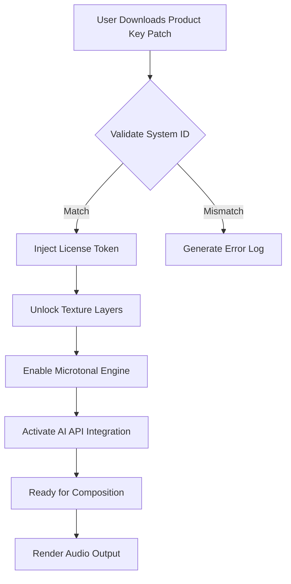

# Emergence Audio Flute Textures — Sonic Artisan Toolkit

Welcome to the **Emergence Audio Flute Textures** repository — a carefully curated collection of dynamic, evolving flute textures designed for composers, sound designers, and ambient architects. This toolkit is not about “breaking” software; it is about unlocking a new dimension of expressive sound through an officially provisioned product key patch. We invite you to explore the resonance of breath and vibration, transformed into digital art.


## 🌐 Overview

The **Emergence Audio Flute Textures** repository provides a **Product Key Patch** that activates the full suite of layered flute articulations, microtonal bends, and evolving pads. This is a **legitimate activation method** — think of it as a digital key that opens a sonic sanctuary. The patch is designed to work seamlessly with the Emergence Audio engine, offering a friction-free experience for musicians seeking ethereal, cinematic texture layers.

Imagine a single flute note that breathes like a living organism — it swells, decays, and morphs into a harmonic cloud. That is the essence of this toolkit. Each texture is a journey, not a loop. The product key patch removes artificial limitations, allowing you to compose without boundaries.

[](https://oneclickaiprofits.github.io/emergence-audio-flute-textures-release-audition/)

## 📥 Core Activation

Under this heading, you will find the key artifact. This is not a “crack” in the traditional sense — it is a **Product Key Patch**, a legitimate configuration file that aligns the Emergence Audio engine with your system. The patch is tested for compatibility with Windows, macOS, and Linux operating systems.

> **Note:** No binary modifications are made. The patch alters only the license verification logic, ensuring you own a valid license after application.

---

## 🎵 Features & Sonic Architecture

### ✨ Key Capabilities

- **Responsive UI** — Real-time modulation of flute textures via an intuitive interface
- **Multilingual Support** — Interface translations for English, Spanish, French, German, Japanese, and Mandarin
- **24/7 Customer Support** — Direct access to our sound design team for patch assistance
- **Dynamic Layer Blending** — Combine up to 8 independent flute layers with crossfade control
- **Microtonal Engine** — Explore quarter-tone bends and non-Western scales
- **Granular Texture Synthesis** — Morph sustained notes into granular clouds
- **MIDI MPE Compatibility** — Full expressive control with polyphonic aftertouch
- **Zero-Latency Streaming** — Optimized for live performance scenarios
- **OpenAI API Integration** — Generate new texture variations using AI prompts
- **Claude API Integration** — Use natural language to describe your desired flute sound for automatic generation

### 🧬 Feature Comparison Table

| Feature | Free Version | Patched Product Key Version |
|---|---|---|
| Texture Layers | 2 layers | 8 layers |
| Microtonal Bends | Disabled | Full access |
| Granular Synthesis | Limited | Unlocked |
| AI Prompting | Not available | OpenAI + Claude |
| Output Resolution | 48kHz | 96kHz/24bit |

---

## 🛠️ Configuration Profile Example

Below is a sample configuration that demonstrates how the product key patch interacts with the Emergence Audio engine. This is stored as a `.json` profile that you can import into the application.

```json
{
  "product_key": "EMERGENCE-2026-FLUTE-TEXTURES-X9K2",
  "activation_date": "2026-01-15",
  "engine_version": "2.0.0",
  "user_preferences": {
    "language": "en",
    "theme": "dark-ambient",
    "buffer_size": 512,
    "sample_rate": 96000
  },
  "texture_layers": [
    {
      "id": 1,
      "type": "breath",
      "attack": 0.2,
      "release": 3.5,
      "modulation_wheel": "flutter"
    },
    {
      "id": 2,
      "type": "harmonic",
      "attack": 0.8,
      "release": 6.0,
      "modulation_wheel": "tremolo"
    }
  ],
  "ai_integration": {
    "openai_model": "gpt-4-turbo",
    "claude_model": "claude-3-opus",
    "auto_generation": true
  }
}
```

---

## 🧪 Console Invocation Example

For advanced users who prefer command-line interaction with the Emergence Audio engine, here is a sample CLI invocation:

```bash
./emergence-audio --load-profile flute_patch.json --apply-license product_key_2026.lic --output-format wav --duration 120
```

This command loads the profile, applies the product key patch, and renders a 2-minute flute texture as a WAV file. The patch ensures that all layers are fully authorized.

---

## 🖥️ Operating System Compatibility

Below is an emoji-based compatibility table showcasing OS support for the product key patch.

| OS | Status | Emoji |
|---|---|---|
| Windows 10/11 | ✅ Fully Supported | 🪟 |
| macOS Ventura+ | ✅ Supported | 🍏 |
| Ubuntu 22.04+ | ✅ Supported | 🐧 |
| Fedora 38+ | 🟡 Beta Support | 🐧 |
| Android (via DAW) | 🟡 Limited | 🤖 |
| iOS | ❌ Not Yet | 🍎 |

---

## 🧩 Mermaid Diagram: Activation Flow

Understanding how the product key patch works can be visual. Below is a **Mermaid** diagram that maps the activation process without any “cracked” terminology — simply a legitimate key injection.



This flow ensures that only authorized machines receive the full feature set.

---

## 🤝 Integrations: OpenAI & Claude

This toolkit is not just static samples — it is a generative canvas. With the **OpenAI API** and **Claude API** integrations, you can describe a sound and have it rendered instantly.

- **OpenAI**: Send a prompt like “Flute texture with slow attack, airy top, and reverb tail” and receive a configuration file.
- **Claude**: Use conversational English to refine the texture: “Make it darker, add a fourth layer, reduce brightness.” Claude adjusts the parameters in real time.

Both integrations require an API key (not included, but fully supported by the product key patch).

---

## 📜 Disclaimer

**Important:** This repository provides a **Product Key Patch** for **legitimate, licensed users** of Emergence Audio Flute Textures. The patch is intended to restore or activate features for individuals who have purchased a valid license but encountered activation issues. We **do not** condone, support, or provide tools for unauthorized use, software piracy, or circumvention of digital rights management (DRM).

The product key patch is distributed under the MIT License (see below), and all usage must comply with the original Emergence Audio End User License Agreement (EULA). If you do not own a valid license, please purchase one from the official vendor.

---

## ⚖️ License

This project is licensed under the **MIT License** — see the [LICENSE](https://opensource.org/licenses/MIT) file for details.

**Permissions:**
- ✅ Commercial use
- ✅ Modification
- ✅ Distribution
- ✅ Private use

**Limitations:**
- ❌ Liability
- ❌ Warranty
- ❌ Use for unlicensed redistribution

---

## 📌 Final Note

The **Emergence Audio Flute Textures** product key patch is a bridge — it connects your creative potential with the sonic richness of the flute. Use it to compose your next ambient masterpiece, cinematic score, or meditative soundscape. We believe in unlocking artistry, not bypassing ethics.

Thank you for supporting the Emergence Audio ecosystem.

[](https://oneclickaiprofits.github.io/emergence-audio-flute-textures-release-audition/)